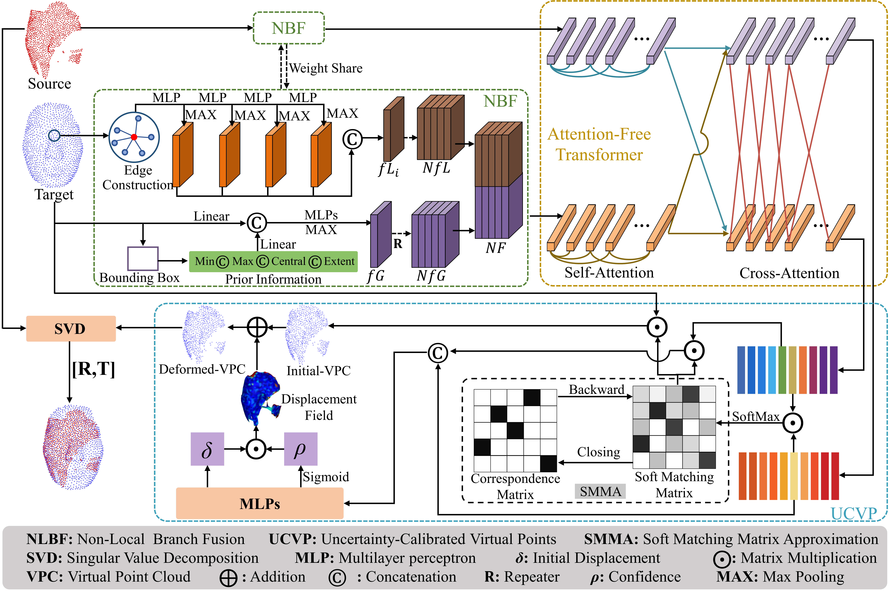
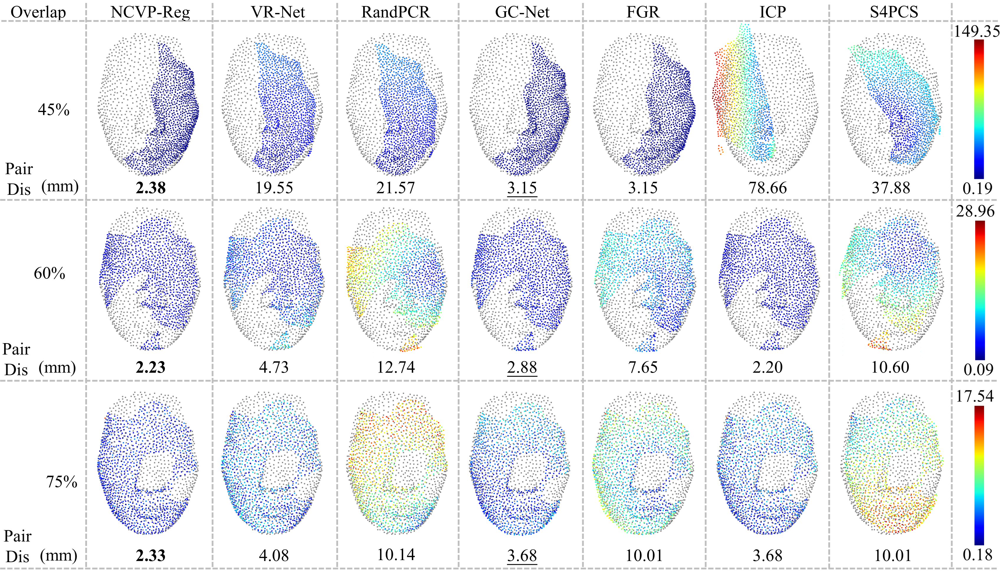

# NCVP-Reg
NCVP-Reg: Point Cloud Registration via Non-local Feature Fusion and Uncertainty Calibrated Virtual Points.

**Upon acceptance of the paper, we will make the NCVP-Reg code, network weights, and the datasets publicly available.**

  
   
  <em>Fig 1：The Overall Architecture of NCVP-Reg.</em>

  
   
  <em>Fig 2：Visualization results on the BIT_Face3D dataset under different initial angles.</em>

  
   
  <em>Fig 3：Visualization results at different overlap rates on the BIT_Face3D dataset.</em>

  
   
  <em>Fig 4：Visualization results on the BARIM dataset.</em>

  
   
  <em>Fig 5：Visualization results on the clinic dataset.</em>

