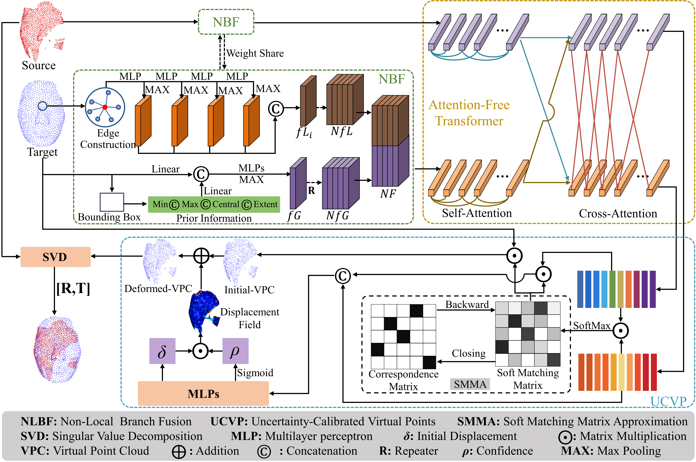
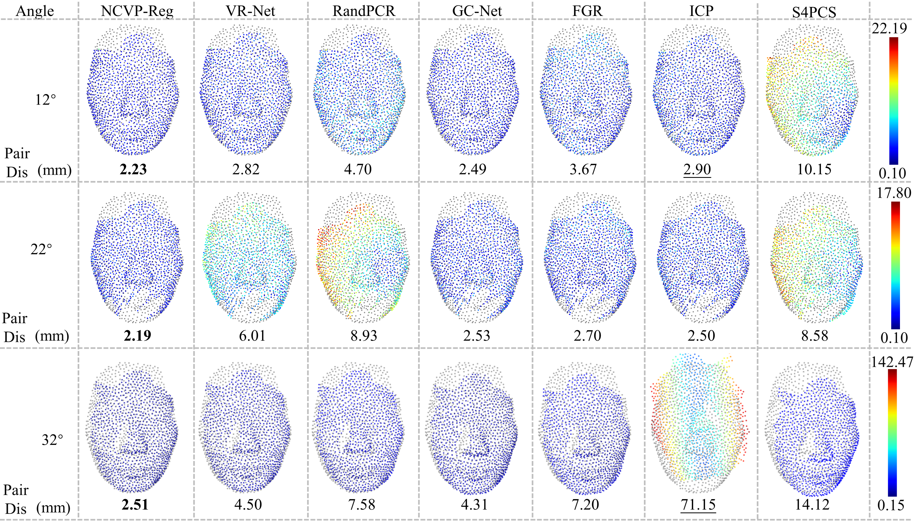
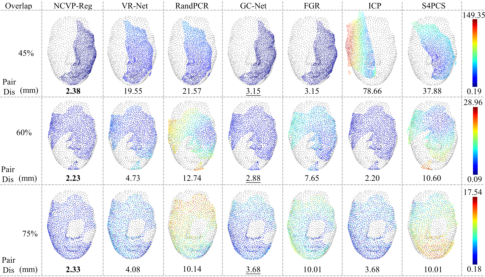
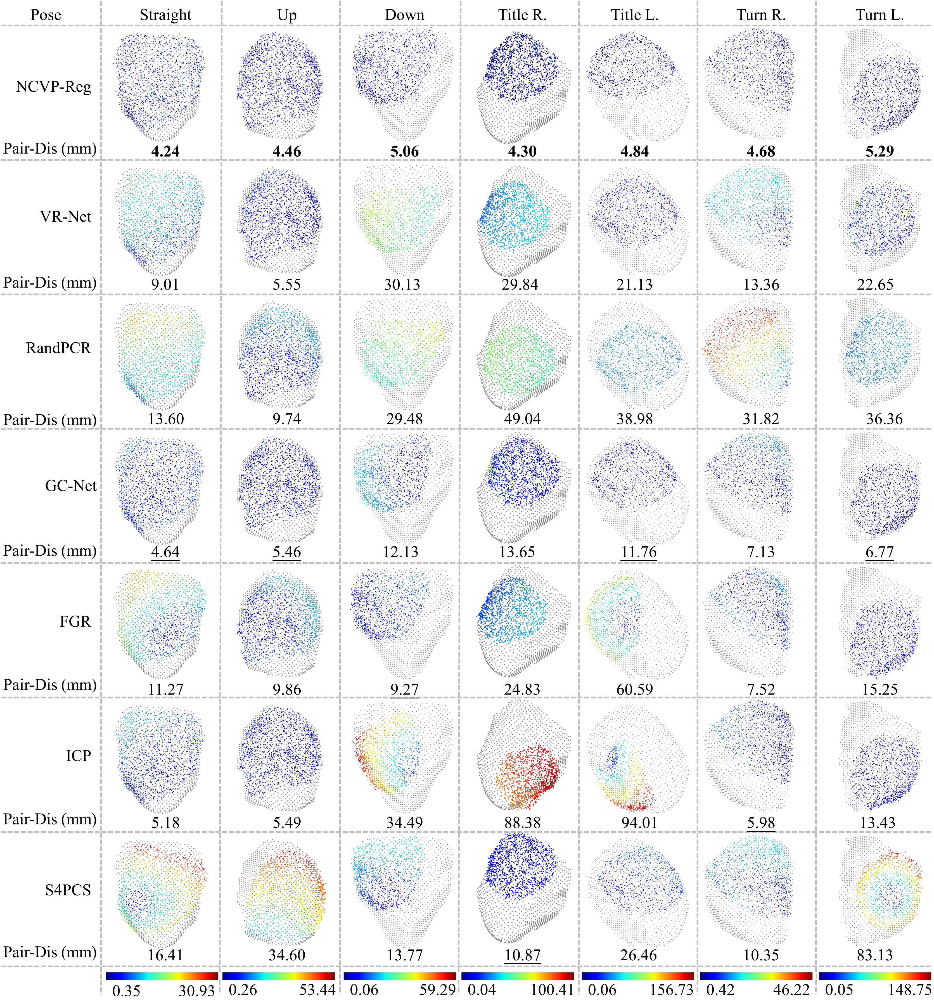

# NCVP-Reg
NCVP-Reg: Point Cloud Registration via Non-local Feature Fusion and Uncertainty Calibrated Virtual Points.

## Setup

```bash
conda create -n ncvpreg python=3.9 -y
conda activate ncvpreg
conda install pytorch torchvision torchaudio pytorch-cuda=11.8 -c pytorch -c nvidia
pip install -r requirements.txt
```

---

## Download

All files (weights, data, results) are available on the cloud drive: **[TODO: add link]**

---

## Files

| File | Description |
|---|---|
| `train.py` | Training script |
| `test.py` | Evaluation script |
| `model.py` | NCVPReg network |
| `util.py` | Loss functions |
| `dataset.py` | Data loader |


---

## Test

```bash
python test.py
```

Loads `last_model.best.t7`, evaluates `test_b_1024.npz`.


For custom or additional data, please contact: **lujzhang@163.com**

<p align="center">
  
  <br />
  <em>Fig 1：The Overall Architecture of NCVP-Reg.</em>
</p>

<p align="center">
  
  <br />
  <em>Fig 2：Visualization results on the BIT_Face3D dataset under different initial angles.</em>
</p>

<p align="center">
  
  <br />
  <em>Fig 3：Visualization results at different overlap rates on the BIT_Face3D dataset.</em>
</p>

<p align="center">
  
  <br />
  <em>Fig 4：Visualization results on the BARIM dataset.</em>
</p>

<p align="center">
  
  <br />
  <em>Fig 5：Visualization results on the clinic dataset.</em>
</p>
